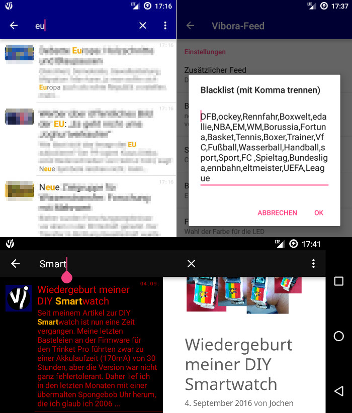
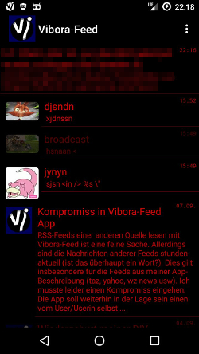
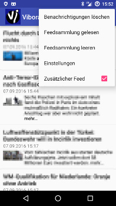
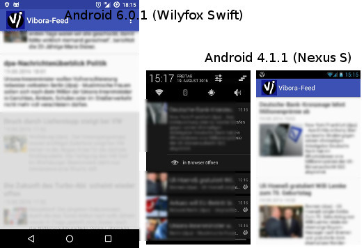
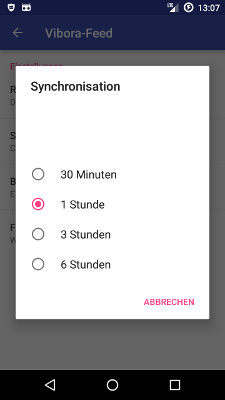
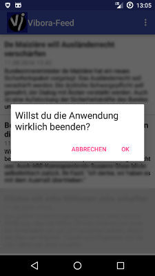
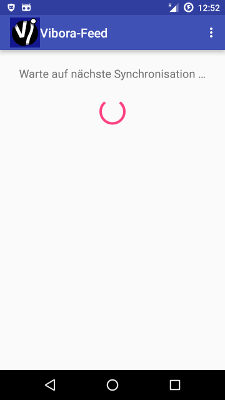

# ViboraFeed

 ViboraFeed is the Vibora Feed Reader of the http://vibora.de opensource blog homepage.
The Images in the screenshots are from testing-Feeds.

Optional get a signed APK from here: [ViboraFeed.apk](https://github.com/no-go/ViboraFeed/blob/master/app/app-release.apk?raw=true)

## Version 2.2

fix a stupid blacklist problem.

## Version 2.1

now it is possible to search in every (non deleted) feed (title and body) via a search function in the ActionBar.

With Nexus S and Android 4.4.4 the nightmode comes by rotating the device. Search and landscape works, too.

## Version 2.0

Change some bugs with night and landscape mode. Blacklist added to filter (new) feeds, if them have some buff word.

## Version 1.9

Optional night mode added (black and red colors in a special timespan) - but works well only > Android 6.0.
Landscape: Screen is splitted. A short click on a news item (left hand) opens a small Browser on the right side.

## Version 1.8

brighter colors

## Version 1.7

classic heise.de rss Security Feed does work. Image and Text content is more seperated.

## Version 1.6

Ich musste leider einen Kompromiss eingehen: Die App soll weiterhin in der Lage sein einen vom User/Userin selbst gewählten Feed zu "empfangen". Allerdings sind die Vibora-Feeds nicht so aktuell wie z.B. die Tagesschau Feeds und daher erscheinen diese am Ende einer langen News-Liste. Daher habe ich einen "Hacken" ins Optionsmenü gemacht, mit dem man Beide Feed-Quellen zusammen darstellen kann. Das war notwendig, da ab Version 1.6 standardmäßig erstmal NUR die Feeds von Vibora gezeigt werden.

*Das Verhalten bzgl. der Notifikationen hat sich nicht geändert.*

## Version 1.5

## Seit Version 1.2 (quasi fertig)

Javadoc ist aus meiner Sicht hinreichend gefüllt. Außerdem werden bei gelesenen Feeds die Bilder auch ausgegraut.

## Seit Version 1.1

- Logo und App-Name kleben nicht mehr beieinander
- Optional kann die App nun auch Bilder aus den Feeds extrahieren
- beginn mit JavaDoc

## Seit Version 1.0 (Mitte August 2016)

- Beim Booten wird Alarm automatisch gestartet
- Modified HTTP wird ausgewertet um Traffic zu vermeiden
- ContentProvider wird für Liste genutzt
- bisher keine Probleme mit Strict Mode
- Netzwerk Verbindung wird geprüft und nach ein paar Sekunden ein neuer Syncr. Alarm gestartet
- Feeds, die man als gelöscht markiert hat werden nach 90 Tagen aus der Datenbank entfernt
- Bei neuen Nachrichten wird ein Sound gespielt
- Man kann die Farbe und Blink-Intervall der Notifikations-LED einstellen
- Klick auf Notifikation öffnet die App
- Komplett auch in englischer Sprache

### weitere Features

Einstellen, wie oft nach neuen Feeds geschaut werden soll

Abfrage, ob man die App verlassen will

Anzeige, wenn noch keine Feeds geladen wurden

Möglichkeit, dem Link eines Feeds zur Webseite zu öffnen sowie andere Optionen

Andere Darstellung der Notifikation innerhalb der App

Jeder neue Feed bekommt eine eigene Notifikation

Options-Menü der App

Einstellungen der App (URL war nur zu Testzwecken anpassbar!)

Als gelesen markierte Feeds werden grau dargestellt

Hinweis, wenn man einen Feed gelöscht oder aus der Datenbank entfernt/zerstört hat

